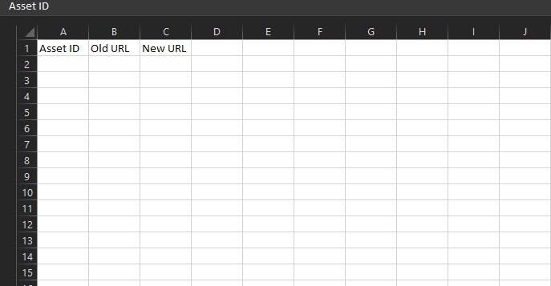
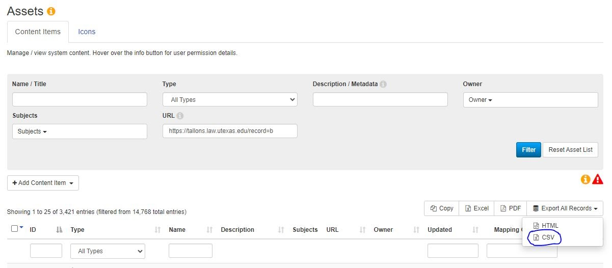
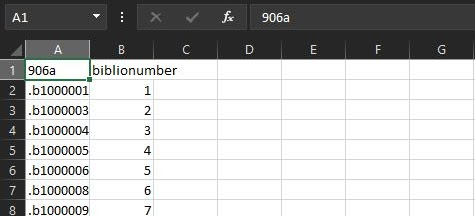
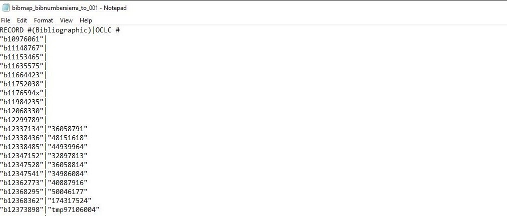
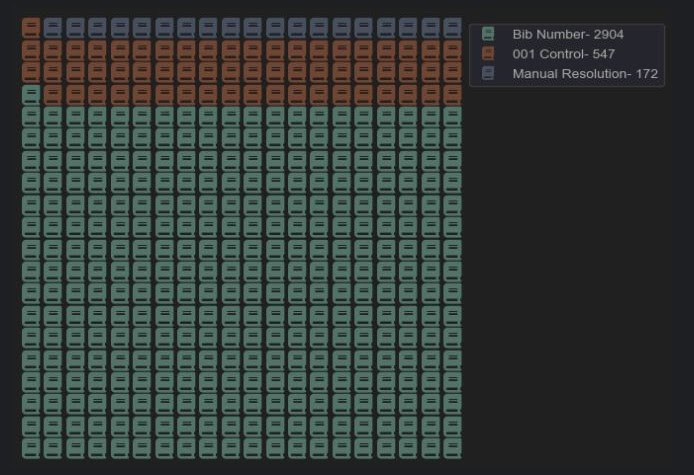
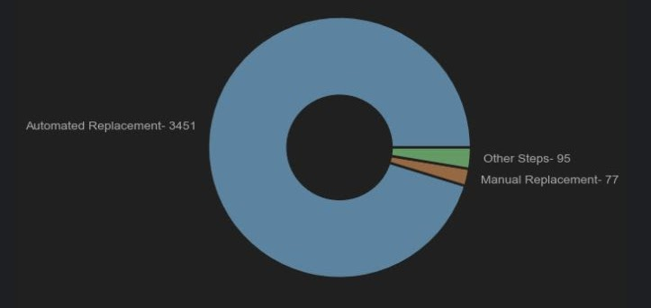

# Libguide Asset Update Documentation

Justin Tung
Reference Librarian, Lecturer
Tarlton Law Library
_______________________________________

## 1. Identifying Assets for Updating

Recently, my library underwent an ILS migration. This broke many asset links in our Springshare content. While it is relatively easy to update libguide asset links individually, when there are many links that need to be updated, doing these individually is best avoided if possible to economize time and sanity. 

Our Access Services Librarian contacted Libguides/Springshare to see if there was an alternative. They responded with a a CSV template:

The idea was to fill out the corresponding information, and they would replace the old URLs with new URLs. 

First, we need to identify the assets that needed updating.  Our old catalog URLs looked something like this:

    https://tallons.law.utexas.edu/record=b1120946~S0

    https://tallons.law.utexas.edu/record=b2171492

    https://tallons.law.utexas.edu/record=b2201706

Clearly, the URL portion that these catalog URLs have in common is "https://tallons.law.utexas.edu/record=b".  By running a search for this partial URL, we were able to identify all of the assets that held old catalog links. In our case, the total number of links was 3623. 

_____________________________________

## 2. First Method: URL Replacement. 

We asked our new ILS vendor for a bib number map which matched old an new record numbers.  The bib number map we recieved looked like the following. Column A is the old record number, and Column B is the new record number.

The new URLs, like the old ones, used a standard format.

    Old: 	https://tallons.law.utexas.edu/record=b___________

    New: 	https://tallons.law.utexas.edu/cgi-bin/koha/opac-detail.pl?biblionumber=____________ 

Since the new URL is standard for all OPAC catalog entries, we could use it as a template. All we had to do was to search for the old URL "b______" number, and grab the new record number, then populate it into the new URL template. In order to do this, I wrote the code in /sample_1. 

This code first opens the CSV from libguide that contains all the assets that need to be updated as well as the bitmap from the vendor. It then parses the record number from the URL in the libguide CSV. After isolating the record number, it matches it to the data line in the bitmap from the vendor and populates the same line with a new column which holds the new ILS URL. 

For example:

    19665471,https://tallons.law.utexas.edu/record=b1451493~S0

becomes:

    19665471,https://tallons.law.utexas.edu/record=b1451493~S0,https://tarlton.bywatersolutions.com/cgi-bin/koha/opac-detail.pl?biblionumber=209474 

If the program wasn't able to find the old record number in the bibmap, it would populate the new column with "NOT FOUND." 

This method was very fast, taking only about a minute. It found 2953 of the 3623 entries, all but 670 records, or ~18.5% of the total.  

_________________________________________

## 3. Second Method: Search by Control Number 

Although over 80% of the records were resolved during the first step, 670 records is still a lot of records to resolve manually. A second method we employed to match new and old URLs was to search our OPAC by MARC field 001 (Control Number).  We exported another bibmap from the new ILS vendor that was essentially the same, except it mapped the old Record Number to 001, rather than the new Record Number.  

The LOC's website officially says that 001 is "assigned by the organization creating, using, or distributing the record". However, our institution uses the OCLC number as the 001 in both the new and old ILS, so it was a consistent data point to find the new OPAC entry for a given catalog entry.  This meant that each record could still be uniquely identified in the new ILS, even if the record number wasn't in the first bibnumber map. The new map looked like this: 

By removing the quotation marks and substituting the pipe character for a comma, it was easy to process this .txt into a CSV. 

However, 001 isn't used in the new ILS URL like how the Record Number is. In order to find the new URL, the 001 needed to be run as a web search. I wrote the code in /sample_2 to solve this issue.

The first step is the same- parse the old Record Number, and find it in the CSV. In order to run the web search, I launch a browser instance using a Python library called Selenium. Using the MechanicalSoup library might be possible, but I'm more familiar with Selenium, so I used that. 

The code launches the browser, populates the search bar with the 001, clicks "search", then returns the resulting URL. Although none of these steps are difficult or complicated, the browser itself runs pretty slowly. I averaged 15.2 seconds per entry, so processing 670 entries took a little under 3 hours. 

If the OPAC can't find a search item, the resulting URL is an error page, not a catalog entry. The program uses regular expressions to look for title and author, which valid catalog entries have, but error pages do not have to quickly distinguish between the two. 

There were three possible outcomes from this code. Firstly, the program could match the old Record Number to the 001, then it could find a valid URL. In this case, the third column was populated with the resulting URL. Secondly, the program could fail to find a corresponding 001, in which case the third column would say "NOT FOUND." In the last case, the program could match to an 001, but the web search would lead to the error page, in which case the third column would say "NO CATALOG ENTRY." 

This program resolved 547 entries out of the 670, leaving ~15.4% of results unresolved, with 96 "NOT FOUND" and 27 "NO CATALOG ENTRY."  Of the original 3623 URLs that needed to be updated, 3500 have new URLs and 123 remain without new URLs.

__________________________________
## 4. Verifying Results

In order to verify the validity of these new links, I wanted to make sure that the new links would resolve to actual catalog pages. In order to do this, I wrote a program that will check the new webpages for bibliographic information. I used a very similar program with the Python library BeautifulSoup with regular expressions to parse title and author. This uses a try/except block to verify this information. The output of this program populates a fourth column of information. If it successfully finds bibliographic data, the fourth column is populated with "VERIFIED". If it raises and error, the column is populated with "PROBLEMATIC". This is where I used the code in /sample_4.

Of the 3500 entries with new URLs, 49 of them returned as "problematic". These required individual attention in addition to the 123 we were unable to generate new URLs for. In total, of the 3623 total assets that need to be updated, 172 remain and require individual attention, or ~4.7% of the overall total.

Of the 172 to address by hand, we were not able to find 95 of them by just searching. This could have been because the items had been withdrawn, or more likely, the records had been made non-public. This means that we ended up setting in 3528 items for Libguides to change.

The last step is to correct these entries and send the template into Libguides for them to batch update the assets. This is easily done by combining the CSV's generated at each step and removing the extraneous information. 

In the end, these were the results. Obviously, the automated replacement methods were the fastest, followed by procedural manual replacement, where a person looked for the resource in the catalog by hand. The most time-consuming step was when someone had to make a decision to change a guide or asset had to reflect an updated state of the library's collections.

______________________________________________________

## 5. Update Results

After sending the completed list into Libguides, they notified us that updates were run on a weekly basis every Friday. After the weekend, we were notified that all the changes we requested had been implemented. I redownloaded all asset links that matched the new URL's, and ran them through another verifier for bib information using Libguides' CSV export and the webscraper I used to verify the links which resulted in a 100% resolution. (Phew!)

This means that at most, the updates themselves would take a week at most. Springshare didn't seem concerned with the number of assets we were updating even though we sent in a few thousand, I'd assume that the number of assets doesn't have that much bearing on how long it takes.

______________________________________________________

## 6. Analysis and Discussion

This method affected several aspects of the consideration of this task:

### 1. Time

It's difficult to quantify the total amount of time these steps took. however, I can confidently say that this was orders of magnitude faster than doing all the updates by hand, which was the only real alternative. Given some of the efforts my coworkers have made in manually updating the links, It's not difficult to imagine that this task would have taken months of consistent, uninterrupted worker hours. Even the links that had to be manually updated were much faster to populate into a CSV rather than go through all the clicks to go change it on the Libguide staff interface. 

My office was able to figure these over the course of a few weeks, but we also had no roadmap for the steps we were supposed to take, with no established practices or methods. Another source of delay is that there was no pre-existing code for me to follow, and I had to write everything from scratch.  Anyone using this roadmap as guidance will likely be able to use my code as a template, but will have to customize it for things like the webscraper and selenium functions. 

Taking all of that into consideration, if I had to perform this task again for a new library with a new system, I believe it would take me about a week. Even if it takes another full week for Libguides to update, this is an astronomical time savings. 

### 2. Reliability 

Verified, automated replacement is reliable and accurate compared to manual methods. Since the majority of the records can be procedurally generated and procedurally checked, this removes many opportunities for human error.

### 3. Vender Support and Data Availability

We relied on support and information from our new ILS vendor. If our ILS vendor wasn't able to provide the information in this way and we weren't able to export the information we needed from our end, It may have been much more difficult to find the corresponding URL's. Additionally,  the lack of these easily accessible data entities could also complicate the code needed at each step. 

### 4. Technical and Coding Requirements

The code used for this project is pretty straightforward. I believe that anyone with a beginner level of proficiency with any similar programming language can adapt this code and figure it out. However, for institutions that don't have access to an individual with such a skill set, this option may not be viable. 

The hardware and software barrier for this option is very low. The website that I use here, replit.com, is a fully-featured developer IDE with many standard and third-party libraries, and can run python code from a browser-based interface. Besides that, all that is required is a reliable internet connection. 

One note is that the second method only works if your OPAC will retrieve the catalog results when queried with 001. If this is not the case, another unique identifier may be more appropriate. I've constructed versions of the selenium search that operate on call number before, but in the end, 001 was more convenient for this project.

Another consideration is that most OPACs will have some form of DDoS protection. In my case, I had to put a 1 second delay into each web request, or the website shut me down. 1 second seems pretty standard in my experience, but some OPACs may be more aggressive. Since this time requirement is on each request, going to, e.g. 2 seconds significantly increases the time it would take.

### 5. Legality

Ideally, these steps would be taken with the support and permission of the institution on behalf of which these actions are performed. However, this may not always be the case. Although a library may be onboard with these steps, the vendor they use to host their ILS or OPAC may have restrictive terms of use. Always make sure what you are doing is in compliance with terms of use and service. When in doubt, get permission in writing from those with authority to give it. 

### 6. Suggestions for improvement

#### A. Using an API instead of interfacing with the OPAC

After conferring with a friend of mine who has a true computer programming background, he suggested that perhaps instead of querying the site as a whole, a better strategy would be to query the API directly, as that has the potential to be much faster both in terms of getting the response from the database as well as not needing to sleep delay requests. He wrote me some sample code using FastAPI, which is a library I'm unfamiliar with. Those who are familiar with it or are concerned with speeding up code as much as possible may find this a good option to explore.

#### B. XPath instead of Regex

To parse HTML, I have exclusively used the Regular Expressions (regex). While regex is very versatile and powerful, it is not the best tool for parsing HTML. A more suited alternative would be to use the XPath., which allows for more specificity, accuracy, and ideally, optimization. This could speed up run time as well as decrease processing and memory demands. 

#### C. Pandas

When I originally wrote these snippets of code, I relied heavily on the CSV because it was both readable as txt and in a spreadsheet application. However, in retrospect, the using python's Pandas library might be worth exploring, since it's C-optimized, and also provides support for native spreadsheet formats, namely .xlsx. However, while I think this could make the workflow easier and make it easier to share and collaborate, the memory and time usage of the code will likely be minimally improved. A lot of the time it takes to run these functions is due to retrieving HTML with BeautifulSoup or operating a browser with Selenium. Changing the data structure doesn't really speed these things up or make them more memory efficient. The primary source of delay likely comes down to website interaction and connection time.

#### D. Multiprocessing

One possible optimization to speed up web requests would be to run parallel processes to handle more requests at a time. This is promising in terms of improving results, but would require more programming proficiency. Since the average computer can easily handle multiple browser instances without throttling, if the code were to run 4-8 browsers at one time, the computer would likely handle them perfectly fine, if enough CPU/GPU/RAM was allocated to that code. 

--------------------------------

Overall, I believe that  looking into these methods and steps are an excellent option for a library looking for a way to maintain many Libguide assets through an ILS migration. However, if the vendor helping a library through this migration offers a service or tool that can translate old links into new ones, then that would be the first option I try to implement. 

If you have any questions about this process, feel free to contact me!
